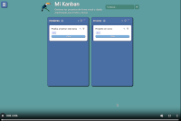
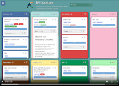

[demo](https://orquidealucinada.net/webkb/)
# Mi Kanban
[🇦🇷 Versión en español](README.md)

   

---
A personal Kanban board that runs entirely in the browser, with no server or database required. All data is saved locally on your device and can be exported to a .json file.  
ONLY THREE FILES! (115kb)  
You can upload the files to your server or use it from your PC, locally. Or both at the same time.

---

## Requirements

- A modern browser (Firefox, Brave, Chrome, Pale Moon)
- The following files must be in the same directory:
  - `index.html`
  - `marked.min.js` (v9.x recommended)
  - `tucan.png`
  - `README.md - optional, embedded in index.html`

---

## Board Structure

The board is organized into **columns** containing **tasks**. Each task can have **notes** written in Markdown.

### Columns

- Created from the sidebar menu (☰)
- Can be **renamed** by double-clicking the column name
- Deleted with the 🗑️ button in the column header
- Deleting a column also deletes all its tasks
- Each column shows a **counter** with the number of visible tasks
- Column **color is customizable** with a palette of 8 colors (🎨 button in the column header). The chosen color is saved in the JSON and persists between sessions.
- The ➕ button in the header opens a modal to add a task directly to that column

### Tasks

- Created from the sidebar or with the ➕ button on each column
- Moved between columns by dragging (desktop) or long press (~400ms) on mobile
- Can be **reordered within the same column** by dragging one task onto another
- Support **tags** separated by commas
- Reserved tag names get automatic special visual styles:
  - `urgente` / `urgent` → white text on red background
  - `importante` / `important` → yellow text on green background
- Support a **due date** with a color indicator:
  - 🟢 Green: due today or more than 3 days away
  - 🟡 Yellow: due within 1 to 3 days
  - 🔴 Red: overdue
- Edited with ✎ and deleted with 🗑️

### Notes

- Each task can have multiple notes with **Markdown** content
- Notes appear collapsed under the task and expand when clicked
- Each note stores its **creation date**, shown next to the title
- A **confirmation toast** appears when saving (or an error notice if the content is empty)
- The editing modal stays open after saving, to continue editing

---

## Search and Filters

- The search field in the header filters in real time by title, tags and note content
- Clicking a tag filters all tasks that share it
- When a filter is active, an **indicator bar** appears below the header showing the active filter with a ✕ button to clear it
- When filtering, columns with no matching results are **automatically hidden**
- Both filters (search and tag) can be active at the same time

---

## Markdown Editor

The note editor toolbar includes:

| Button | Function |
| :--- | :--- |
| Hn | Headings H1, H2, H3 |
| B | Bold (`**text**`) |
| *I* | Italic (`*text*`) |
| Cód | Code block (` ``` `) |
| ` | Inline code |
| List | Bullet list (`- item`) |
| ☐ | Checklist (`- [ ] item` / `- [x] item`) |
| " | Blockquote (`> text`) |
| 🔗 | Link (`[text](url)`) |
| ⊞ | Table template (3 columns) |
| — | Horizontal rule (`---`) |

### Tables

The ⊞ template includes alignment separators:

```
| Col1 | Col2 | Col3 |
| :--- | :---: | ---: |
| left | center | right |
```

> The separator line (`| --- |`) is mandatory. Without it, the text won't render as a table.

### Checklists

```
- [ ] Pending task
- [x] Completed task
```

Completed items are shown in green. State is changed by editing the note.

---

## Backup

From the **Backup** section in the sidebar:

- **Export JSON**: downloads a file with all board data, timestamped
- **Import JSON**: loads a previously exported backup, replacing current data

> Regular exports are recommended. Data is stored in the browser's `localStorage` and may be lost if history or cache is cleared.

---

## Technical Notes

- No external runtime dependencies (fully local)
- Markdown rendered by [marked.js](https://marked.js.org/) v9.x with full GFM support
- Compatible with Firefox, Brave, Chrome and Pale Moon
- Mobile drag & drop uses long press (~400ms) to avoid interfering with scroll
- Data persists in localStorage with a compatibility wrapper for Pale Moon
- Content Security Policy explicitly blocks external network connections  

The idea behind using localStorage with the ability to export and import in .json format is to facilitate portability without relying on servers or complex backends: localStorage acts as immediate working storage, while the .json file is the actual long-term persistence mechanism.

---
**Issue with Pale Moon (local file)**: When loading the page, an attempt to connect to internal addresses (such as 0.0.0.2) may occur. This is browser behavior, not application behavior, and does not affect functionality or privacy. It does not occur when accessing from a web server.

---

## Ideas

- 📂 You can create backups in specific folders for different projects, keeping several projects handy at once.
- 📄 You can create columns for notes of different kinds.
- 🗃️️ You can use Dropbox or Google Drive to sync your data wherever you are.
- Column ideas: Ideas, In Progress, Done, Discarded, Notes, etc.

---

## Credits

**Code and development**
Claude Sonnet (Anthropic) — architecture, implementation, bug fixing and cross-browser compatibility

**Design, concept and direction**
[Daniel Horacio Braga](https://orquidealucinada.net) — visual design, feature definition, multi-platform testing (Firefox, Brave, Pale Moon, mobile), and iterative feedback

**Dependencies**
- [marked.js](https://marked.js.org/) — Markdown parser, MIT license

---

## License

**Mi Kanban** — Copyright © 2026 [Daniel Horacio Braga](https://orquidealucinada.net)

This program is free software: you can redistribute it and/or modify it under the terms of the **GNU General Public License** as published by the Free Software Foundation, either version 3 of the License, or any later version.

This program is distributed in the hope that it will be useful, but **WITHOUT ANY WARRANTY**; without even the implied warranty of MERCHANTABILITY or FITNESS FOR A PARTICULAR PURPOSE. See the GNU General Public License for more details.

You should have received a copy of the GNU General Public License along with this program. If not, see [https://www.gnu.org/licenses/](https://www.gnu.org/licenses/).

> Note: the GPL license applies to the **Mi Kanban** source code. The **marked.js** library is distributed under its own MIT license, which is compatible with GPL.

## 🎬 Video

[](https://orquidealucinada.net/webkb/video1.mp4) [](https://orquidealucinada.net/webkb/video2.mp4)

